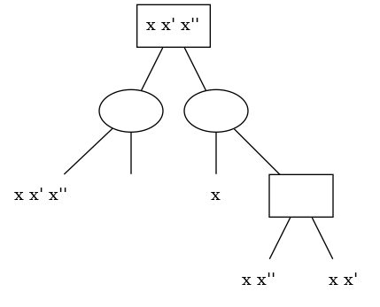

<!-- vim: set spelllang=en : -->

# SuperReconciliation

Implementation of the Super-Reconciliation model for reconciling a set of trees accounting for segmental duplications and losses.

_Note:_ for now, this implementation only works on supertrees and still lacks functionality to build supertrees from a set of consistent gene trees.

## Building

### Requirements

* a C++ compiler supporting the C++14 standard, _eg._ Clang ≥3.4 or GCC ≥6;
* Boost libraries ≥1.60;
* CMake ≥3.1.

> **Warning:** there is a bug in GCC preventing the `evaluation` program from working properly. This bug was reported and fixed in releases starting from 6.5, 7.4, 8.2 or 9 (see [the bug report](https://gcc.gnu.org/bugzilla/show_bug.cgi?id=86291) for more details).

### Commands

The following commands can be used for building on a Linux-based machine meeting the requirements:

```sh
mkdir -p build/Release
cd build/Release
cmake -DCMAKE_BUILD_TYPE=Release ../..
make
```

## Usage

After building, all executables can be found in `build/Release`. To ensure everything works as intended, run the unit tests program, `tests`, and make sure that all tests pass (feel free to report any problem).

### Input/output formats

The various programs use [the NHX format](https://home.cc.umanitoba.ca/~psgendb/doc/atv/NHX.pdf) for inputting or outputting trees, in which the name of a node is used for encoding its synteny (list of gene families) and the NHX tag `event` is used for encoding the event (either `duplication`, `speciation` or `loss`) at a given node.

For example, the following NHX string represents one of the erased synteny trees of the paper (see the `examples` directory for more examples):

```nhx
(
    (
        "x x' x''",
        [&&NHX:event=loss]
    )[&&NHX:event=speciation],
    (
        "x",
        (
            "x x''",
            "x x'"
        )[&&NHX:event=duplication]
    )[&&NHX:event=speciation]
)"x x' x''"[&&NHX:event=duplication];
```



### Programs

#### `reconcile`

This is the main program. It takes an erased supertree on standard input and outputs the inferred tree based on the Super-Reconciliation method (either unordered or ordered). This implements the main algorithm of the paper.

#### `simulate`

Randomly simulate an evolutionary history based on a ficticious ancestral synteny of given length, and outputs a fully-labeled tree of this history.

#### `erase`

Erase information from a full synteny tree to make it suitable for super reconciliation.

#### `evaluate`

Create a sample of simulated evolutions, and, for each reference tree, erase information and use the result as input to the Super-Reconciliation algorithm. Evaluate given metrics:

* `dlscore`: difference between the reference tree’s duplication-loss count and the reconciled tree’s duplication-loss count;
* `duration`: measure the time required to compute the Super-Reconciliation.

#### `viz`

Generate a visualization of a synteny tree. Takes a synteny tree on standard input and outputs it in a Graphviz-compatible format on standard output. If you pipe the output to the `dot` utility, you can view the tree in a variety of formats such as PNG or PDF.

#### `tests`

Run unit tests.

### Example

Simulate one evolutionary history and output three trees:

* the reference, fully-labeled tree;
* the erased version with removed labels on internal nodes;
* the reconciled version after applying the Super-Reconciliation method.

```sh
./simulate | tee \
    >(./erase | tee \
        >(./viz | dot -Tpdf >! tree-erased.pdf) \
        >(./reconcile | ./viz | dot -Tpdf >! tree-reconciled.pdf) \
    ) \
    | ./viz | dot -Tpdf >! tree-reference.pdf
```

### Reproducing results

Raw data used for the publication can be found in the JSON format in the `tools/results` directory. This directory also contains a simple Python script for plotting results.

To recreate those files:

```sh
# ordered-by-depth: Test the Super-Reconciliation on varying
# input tree depths
./build/Release/evaluate \
	--jobs <NUMBER_OF_CORES_TO_USE> \
	--sample-size 500 \
	--depth '[1:14]' \
	--metrics duration --metrics dlscore \
       	ordered-by-depth.json

# ordered-by-length: Test the Super-Reconciliation on varying
# ancestral synteny lengths
./build/Release/evaluate \
	--jobs <NUMBER_OF_CORES_TO_USE> \
	--sample-size 500 \
	--base-size '[1:14]' \
	--metrics duration --metrics dlscore \
       	ordered-by-length.json

# unordered-by-depth: Test the Unordered Super-Reconciliation
# on varying input tree depths
./build/Release/evaluate \
	--jobs <NUMBER_OF_CORES_TO_USE> \
	--sample-size 500 \
	--depth '[1:14]' \
	--metrics duration --metrics dlscore \
	--unordered --p-rearr 0.7 \
       	unordered-by-depth.json

# unordered-by-length: Test the Unordered Super-Reconciliation
# on varying ancestral synteny lengths
./build/Release/evaluate \
	--jobs <NUMBER_OF_CORES_TO_USE> \
	--sample-size 250 \
	--base-size '[1:500]' \
	--metrics duration --metrics dlscore \
	--unordered --p-rearr 0.7 \
       	unordered-by-length.json
```
